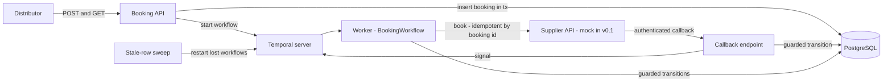
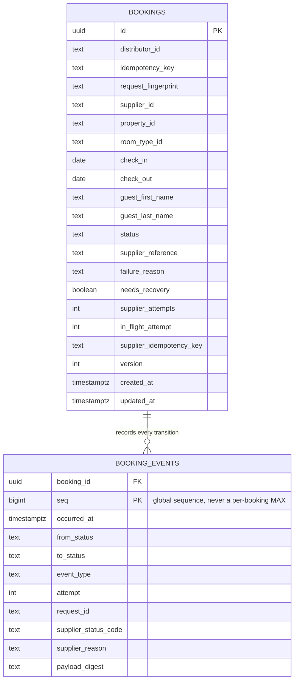
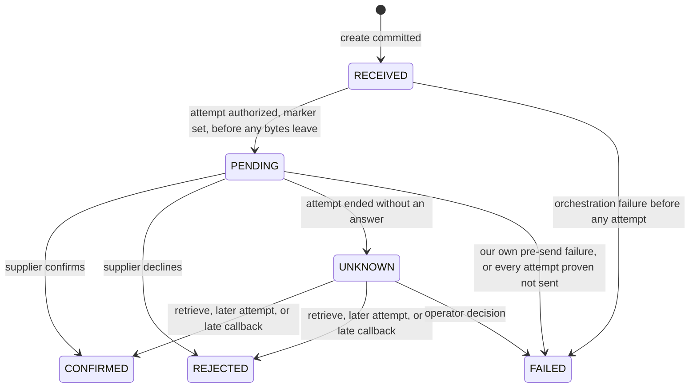
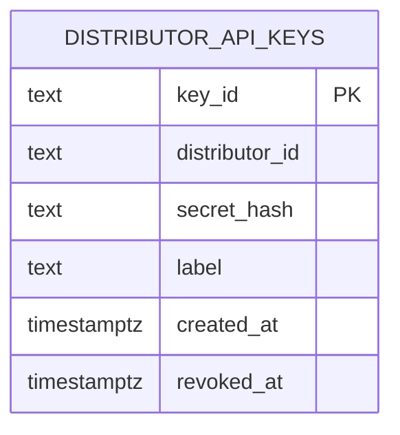
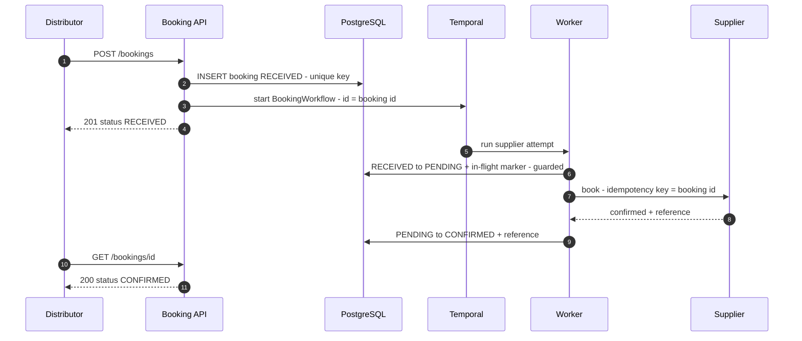
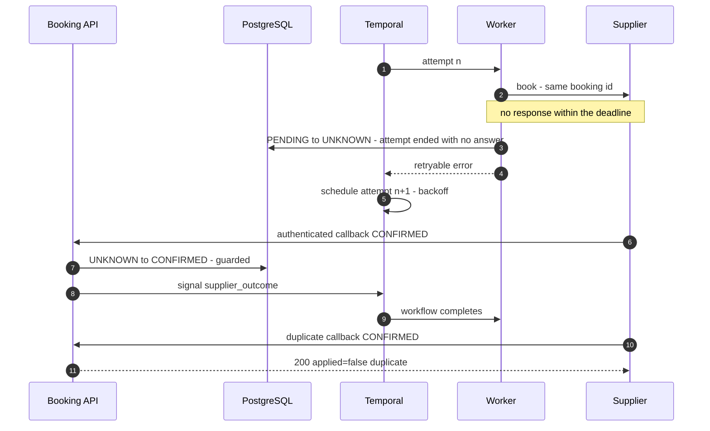

# [RFC] Supplier Booking Orchestration Service

| | |
|---|---|
| **Author** | Ridwan Afwan Karim Fauzi |
| **Status** | Approved, v0.1 implemented |
| **Created** | 2026-08-24 |
| **Repository** | `github.com/ridwanakf/booking-orchestration-service` |
| **Companion docs** | `README.md` (setup, run instructions, API examples, operational notes) |
| **Version** | v3.0 |

---

## 0. Summary

- A booking orchestration service between travel distributors and unreliable hotel suppliers: it accepts bookings, drives the supplier interaction, and is the durable source of truth for booking state.
- Architecture in one line: PostgreSQL owns business truth, one durable Temporal workflow per booking owns the process, database constraints own idempotency, guarded transitions own state correctness.
- The central principle: a supplier timeout is an unknown outcome, never a rejection. UNKNOWN is a first-class state, resolved by supplier-safe retries where the supplier supports them, by a callback, or by outcome recovery.
- For a compliant distributor, duplicates are prevented at three boundaries: distributor to service (unique key plus fingerprint), service to supplier (a reference the supplier can deduplicate on, which v0.1 models and production must verify per supplier, 2.1), supplier to service (guarded state-based dedupe).
- Create answers before the supplier does, on purpose: the booking is committed before anything can fail, so every later failure is recoverable. A synchronous call would hold the intent in an in-flight request, where a crash loses it (6.1).
- Every transition is recorded in an append-only `booking_events` row written in the same statement, so the question "why is this booking in this state" is answerable from the database rather than reconstructed from logs (6.2).
- Section 4 lists exactly what v0.1 ships; its non-goals table and section 8 list what it deliberately does not.

## 1. Glossary

| Term | Meaning |
|---|---|
| Distributor | The demand partner (agency, platform, seller) that sends booking requests and retries them when a response is inconclusive. The word is used in the demand-side sense throughout; parts of the industry use it for the supply side, so the glossary sense governs here |
| Supplier | An external hotel/inventory API that fulfils bookings; unreliable by assumption |
| Booking | One guest-stay request, tracked end-to-end as a single durable record |
| Request fingerprint | SHA-256 over the canonical form of the parsed create payload (sorted fields, trimmed strings, key excluded), immune to byte-level serializer differences. It can only distinguish what the payload carries: a fuller booking payload would add occupancy, room count, and residency, and the fingerprint would strengthen with it (12) |
| Booking id | Our own durable identity for a booking, minted at creation |
| Distributor idempotency key | The distributor's request identity, meaningful only at our API boundary, unique per distributor |
| Supplier idempotency key | The identity the supplier deduplicates on. In v0.1 we map the booking id onto it, a design mapping rather than an identity |
| Supplier reference | The supplier's own reservation identifier, returned with the confirmation; null until a definitive answer. Distinct from the hotel's confirmation number, which the guest needs at check-in and which may arrive later or not at all (2.1); v0.1 stores only the first. Note that at least one major supplier uses the same words for the hotel's identifier rather than its own, so the field is named for what it holds and the contract says which |
| Stable reference | The booking id used as the correlation handle across every supplier interaction, present from creation and unchanged by retries |
| Callback | A supplier-to-service notification of a booking outcome; may arrive more than once |
| UNKNOWN | Booking state meaning the supplier may hold this booking and the outcome is unproven |
| Workflow | One durable Temporal execution driving one booking's supplier interaction |
| Activity | A unit of work inside a workflow, retried under a declarative policy |
| Sweep | A background pass that starts a workflow for any unsettled booking (flagged ones only while they are not parked) whose row has been quiet past its threshold. It repairs lost starts and closed executions alike, and writes no state itself |
| Outcome recovery | Resolving a booking whose supplier outcome is unproven, by querying the supplier or waiting for its truth. Deliberately not called reconciliation: on a commerce platform that word means matching supplier invoices and statements against consumed stays and payments, and the two would be confused in the same conversation |
| Guarded transition | A state change applied as `UPDATE ... WHERE status = <expected>`, checked by rows affected |
| Entry dispatch | The first thing every started or restarted run does: read the row, resolve a set marker to UNKNOWN, and decide from the result. It is what makes a run safe to start against any booking, which is what makes the sweep safe |
| In-flight marker | `in_flight_attempt`, the attempt number of an outstanding supplier call, set before any bytes leave and cleared by the attempt that set it. Doubt lives here rather than in `status`, which is what keeps a healthy booking out of UNKNOWN |
| Version | A counter on the booking row, incremented by every write. It is the value returned to a caller as an ETag; see 6.6 for where it is a guard and where it is only a record |
| Lineage | The append-only `booking_events` row written in the same statement as each transition or refusal (6.2). Distinct from workflow history, which is per-execution telemetry |
| Authorization write | The guarded write that permits one supplier attempt: it sets the in-flight marker and counts the attempt in one statement, before any bytes leave. No supplier call happens without one |
| Signal | An event delivered to a running workflow; here always a wake-up hint, never the carrier of business truth |
| Task queue | The queue workers poll for workflow and activity work; its schedule-to-start latency is a leading health signal |
| Compensation | An explicit undo for a completed step, such as cancelling a supplier booking by its supplier reference |
| Settled state | A state with no automatic exits, also called terminal in the invariants: REJECTED, FAILED, CANCELLED (modeled, reserved for the production cancellation flow), and CONFIRMED, whose only exit is that same flow in 8.3 |
| Parked | An UNKNOWN booking flagged `needs_recovery` and no longer retrying, awaiting a callback or outcome recovery. Reached when the retry budget is exhausted |

## 2. Background

- Travel distribution sits between demand partners ("distributors") and hotel inventory ("suppliers"); the supplier side is the unreliable half of the exchange.
- A supplier API may confirm immediately, reject immediately, or time out and confirm minutes later; requests and callbacks can both arrive more than once; distributors retry whenever a response is inconclusive.
- The commercially expensive failure is the duplicate booking (two rooms sold for one intent); the silently lost booking is a close second.
- This service is the orchestration layer that makes the boundary safe: it accepts distributor bookings, drives the supplier interaction, and is the durable source of truth for booking state.
- A timeout is treated as an unknown outcome, never as a rejection; v0.1 converges to supplier truth through bounded retries against a supplier that deduplicates on our reference, and through authenticated callbacks. Against a supplier that does neither, the outcome recovery pass (8.1) is the resolution rather than an enhancement; until it exists, parked records are recovered by hand.

A supplier interaction can end in any of six ways, all first-class here:

1. The supplier confirms immediately.
2. The supplier rejects immediately.
3. The request times out, but the supplier confirms later.
4. The supplier receives the same booking request more than once.
5. The supplier sends the same confirmation callback more than once.
6. The distributor retries its original request after a timeout or inconclusive response.

### 2.1 How hotel suppliers actually behave

The mechanisms below are chosen against this reality, not against a generic unreliable service:

- **Book calls are synchronous, and their tail is long.** The median against contracted allotment is a few seconds; the tail stretches to tens of seconds when the call crosses a switch or a central reservation system for re-sold or direct-connect inventory. The property's own system is generally not in the synchronous path at all, which is exactly why the hotel's confirmation number can arrive later than the supplier's. Set the deadline against the tail and alert on the median: a deadline set at the median manufactures ambiguity out of healthy bookings and then retries into it.
- **Asynchronous confirmation callbacks are the exception.** Most suppliers answer on the call. What arrives asynchronously, from the larger ones, is cancellation and modification notice. This service accepts a confirmation callback because some suppliers do send one and because it makes the late-confirmation path demonstrable, but the production answer to an unproven outcome is to retrieve the booking, not to wait for a push.
- **Create is rarely idempotent; retrieve-by-our-reference usually works.** Suppliers commonly echo and index a client reference rather than deduplicating on it. That inverts the naive strategy: a retry is not safe by default, and the reliable recovery is to look the booking up by the reference we sent before deciding anything. Three caveats make that recovery harder than it sounds: the reference is usually not enforced unique, so a retrieve can return more than one booking and that is itself the duplicate signal; there is an indexing lag, so not-found immediately after a timeout is not proof of not-created; and the field is short and often alphanumeric-only, so a raw identifier will not fit and must be encoded down to the supplier's limit.
- **Some suppliers answer "on request" rather than yes or no.** That is a definitive answer meaning the booking is held and confirmation will follow in hours or days, resolved by polling or by mail rather than by a push. It is neither a confirmation nor an ambiguity, and treating it as ambiguous is how a system creates duplicates against exactly the supply that is slowest to correct them.
- **Two references, not one.** The supplier's own reservation id arrives with the confirmation; the hotel's confirmation number, which the guest needs at check-in, may arrive later or never. They are different fields with different lifetimes.
- **Confirmation is not binary.** Real answers include confirmed at a different rate and confirmed with a substitution. Those are commercial acceptance events requiring pricing and rate-plan context, which is outside this service's v0.1 contract, so it refuses to model them rather than pretending a boolean covers them.

Sizing assumption: low thousands of bookings per day, single-digit RPS peaks. The mechanisms below (row-level state in PostgreSQL, one workflow per booking) hold orders of magnitude beyond that; see section 9, question 6, for the scale path.

## 3. Requirements

| ID | Requirement | Solved in |
|---|---|---|
| R-01 | `POST /bookings` accepts an idempotency key alongside the booking payload | 6.4, 6.6 |
| R-02 | Creating a booking produces a durable record before anything else happens | 6.2, 6.5 |
| R-03 | The supplier request is scheduled asynchronously; the API answers immediately with current state | 6.1, 6.5, 7 |
| R-04 | The same distributor request never creates two bookings | 6.6 |
| R-05 | `POST /bookings` returns the booking's current status | 6.4 |
| R-06 | `GET /bookings/{bookingId}` returns current state and identifiers | 6.4 |
| R-07 | `POST /supplier/callbacks` processes duplicates safely; no invalid or repeated state changes | 6.3, 6.4, 6.6, 6.8 |
| R-08 | A supplier mock simulates immediate confirmation, immediate rejection, and timeout followed by late confirmation | 6.1 |
| R-09 | The state model, allowed transitions, timeout representation, and invalid-transition prevention are explicit | 6.3 |
| R-10 | Booking state is persisted in a real store with durable constraints | 6.2 |
| R-11 | No duplicate bookings under distributor retries, duplicate callbacks, or background retries to the supplier | 6.6 |
| R-12 | Confirmed supplier failure, network timeout, unknown outcome, and internal failure are distinguished | 6.3, 6.7 |
| R-13 | Two identical simultaneous requests are resolved by a database constraint, not an in-memory lock | 6.5, 6.6 |
| R-14 | Logging supports investigating creation, supplier calls, timeouts, callbacks, duplicates, and transitions | 6.9 |

## 4. Goals and non-goals

Goals for v0.1:

- R-01 through R-14, built and tested.
- Token-authenticated callbacks (static shared secret), with HMAC signing as the first upgrade if ahead of schedule (6.8).
- Structured event logging.
- The test suite in 6.10.

Non-goals for v0.1, each deliberate:

| Non-goal | Why | Where it lands |
|---|---|---|
| Pricing, payments, ledger | This service orchestrates booking state, not money | Separate service; out of scope |
| Availability search | The supplier is the source of availability truth at booking time; a rejection covers "no rooms" | 12 |
| Real supplier integrations | The supplier client is an interface; v0.1 ships the mock behind it | 8.6 |
| Distributor authorization beyond tenant scoping | Per-distributor API keys and scoped reads ship in v0.1 (6.4). Scopes, quota, and delegation need a policy model, not just an identity | 8.9 |
| Multi-supplier routing | Schema is ready (`supplier_id`); routing needs a registry | 8.6 |
| Metrics dashboards | Events ship in v0.1; the metrics are named | 8.8 |
| Distributor webhooks | Polling `GET` is the v0.1 contract | 8.5 |
| A separate callback ledger | `booking_events` (6.2) records callbacks alongside every other transition, including the ones refused as duplicates or conflicts, so a second table would duplicate it | 8.2 |
| Cancellation (distributor- and supplier-initiated) | Designed in full for additive integration: CANCELLING state, durable compensation, retry-safe replay, supplier-truth callback semantics | 8.3 |
| Booking amendment (dates, guest details) | Most bedbank channels do not support amend at all and force cancel-and-rebook, which needs the cancellation design first | 12 |
| Repriced or partial confirmation | A supplier confirming at a different rate, or confirming some rooms, is a commercial decision needing price, currency, occupancy, and a rate plan. The payload here carries none of them by design; modelling it half-way would be worse than refusing it | 2.1, 12 |
| Rate plans, rate keys, and pricing fields | A real book call carries a rate plan and a short-lived rate key from a preceding check. This service orchestrates the booking attempt, not the offer that produced it | 2.1 |

## 5. Ideal end state

The same service shape operating a fleet of suppliers:

- Per-supplier task queues with rate limits.
- Fallback supplier chains and compensation flows as workflow branches.
- An outcome recovery loop querying supplier retrieve APIs.
- Signed callbacks and distributor webhooks.
- Lineage partitioned and streamed, feeding audit, analytics, and downstream reconciliation.

v0.1 already stands on the end-state orchestrator, so the path there is additive rather than a rewrite: every item in section 8 extends a seam that exists today.

## 6. v0.1 design

### 6.1 Architecture



How it fits together:

- One deployable service plus two backing components, PostgreSQL and Temporal, both in the compose file (Temporal UI included).
- The API writes the booking row, then starts one durable workflow per booking; workflow ID = booking id.
- The workflow's activity performs supplier attempts under a declarative retry policy.
- Every state change (worker or callback endpoint) goes through one shared guarded transition function.
- Callbacks update the row first, then signal the workflow.
- The sweep is one query, run on a fixed interval by every replica:

```sql
SELECT id FROM bookings
WHERE status IN ('RECEIVED', 'PENDING', 'UNKNOWN')
  AND NOT (needs_recovery AND status = 'UNKNOWN')          -- parked rows are recovery's, not ours
  AND (
        (in_flight_attempt IS NOT NULL AND updated_at < now() - $1::interval)   -- marker stale
     OR (status = 'RECEIVED'            AND updated_at < now() - $2::interval)
     OR (in_flight_attempt IS NULL      AND updated_at < now() - $3::interval)
      )
ORDER BY updated_at
LIMIT $4
```

  It writes nothing. Ordering oldest-first drains a backlog in the order bookings went quiet, and the limit means a backlog drains over several passes rather than flooding the task queue in one.
- A sweep starts workflows for any booking that is not settled and has gone quiet past its staleness threshold, measured from `updated_at`. Flagged rows are skipped only while UNKNOWN: that is the parked case, and it is the only one where something else is expected to pick the booking up.
- **Staleness is a question about time, which is why it is not a counter.** A revision number can say a booking changed; it cannot say it has not changed *for thirty seconds*, and answering that would mean recording when the revision last moved, which is `updated_at` again. Two properties make it trustworthy: `now()` is the **database's** clock and every replica queries the same database, so there is no skew to reconcile and the sweep is safe to run on every instance; and a trigger fills `updated_at` on any update that does not set it itself, so no future write path can strand a booking by forgetting it.
- **Marker staleness threshold, a third and much shorter one.** A row in PENDING whose `in_flight_attempt` is set and whose `updated_at` is older than the supplier deadline plus its activity backstop cannot have a live call behind it: the call would have returned or timed out by now. The sweep restarts those first, and the restarted run's entry dispatch resolves the marker to UNKNOWN. Age alone would have to wait out the much longer in-flight threshold. It is exempt from the "beyond the recovery window" rule that governs the age-only threshold, and deliberately so: that rule exists to stop a booking being swept while an attempt is legitimately running, and this threshold applies only where the marker proves one cannot be.
- The thresholds are derived, not picked. **30s for RECEIVED** is the budget for a workflow to start: long enough that a healthy start is never swept, short enough that a lost start is repaired before a distributor notices. **15 minutes for in-flight** sits deliberately beyond the whole recovery window, so a booking that is still legitimately retrying is never restarted underneath itself. RECEIVED rows are the common case, closing the gap between the row commit and the workflow start. PENDING and UNKNOWN rows are the important one: an execution terminated by a deploy, an operator, or a determinism failure is closed, so it raises no orchestrator alert and would otherwise sit untouched forever. One query, one wider status set, no per-row bookkeeping.
- Start by workflow ID is idempotent, so a live execution is a no-op and a start against an already settled row exits at the entry dispatch. Recovering executions that died after starting is the orchestrator's own problem, visible in its schedule-to-start latency, and is left there deliberately (8.13).
- Accepted consequence: a booking whose execution fails on every start is restarted indefinitely. Each attempt is cheap and reaches no supplier, and it surfaces as repeated workflow-task failures and rising schedule-to-start latency rather than as a stuck booking. It sits in RECEIVED and is never flagged, so the outcome recovery pass will not see it either: this is an orchestration fault, and it is meant to be found in orchestration telemetry rather than in the booking table. Bounding it durably needs per-row state, which is exactly the mechanism that has proven easier to get wrong than to live without, so it stays on the roadmap (8.13).

The mock supplier, an HTTP service mounted in the same binary so the client exercises a real transport, real deadlines, and real status codes:

- Lives in the same binary behind the supplier-client interface, selected by configuration.
- Scenario chosen by `roomTypeId` suffix: `-confirm`, `-reject`, `-timeout`, `-unclassified` (a `200` carrying an error envelope with no recognized decline code, which is the harder case: a success status that must not be read as success). Any other value, including the plain `room-deluxe` of the examples, confirms.
- Honours the booking id as an idempotency key: repeats get the same answer.
- The timeout scenario holds the request past the client deadline, then posts an authenticated callback to the configured callback URL after a delay comfortably longer than the deadline, and posts it twice, so duplicate delivery is demonstrable without hand-crafting a request. Its `supplierReference` is minted once per booking and reused on both.

#### Why create answers before the supplier does

A real book call traverses a bedbank, a channel manager, and a property system, and its tail runs to tens of seconds (2.1). That single fact decides the API shape, so it is worth showing the alternatives rather than asserting the choice.

| Approach | How it works | Pros | Cons |
|---|---|---|---|
| **Fully synchronous** | hold the HTTP connection until the supplier answers | one round trip; the distributor gets a final answer with no polling; simplest client | a slow supplier holds the caller's connection until the **caller's** timeout fires, and that timeout is not ours to set. The distributor then retries, multiplying load on a supplier already struggling. Worse, a crash mid-call loses the intent entirely: nothing was committed, so no sweep can recover it. It also couples our availability to theirs |
| **Accept, then poll** (chosen) | commit the row, return `201 RECEIVED`, distributor polls `GET` | the booking is durable before anything can fail; supplier latency never reaches the caller; retries are ours to schedule and meter; one code path | the distributor must poll, and learns the outcome later than it would synchronously |
| **Accept, then webhook** | commit and return, push the outcome to the distributor | no polling; lowest latency to notification | needs distributor endpoint registration, delivery retries, and its own signing and dedupe story. It is the polling contract plus a second delivery problem, so it belongs after polling works (8.5) |
| **Bounded wait, async fallback** | wait a short budget (say 2s), answer synchronously if the supplier is fast, otherwise fall back to `202` | best of both for the common fast case | two response shapes for one endpoint, so every client implements both paths anyway. The bounded wait also has to be shorter than the distributor's timeout, which we do not control. A v0.2 option once the async path is proven |

The decisive argument is not latency, it is **what survives a crash**. Under the chosen approach the booking is committed before any failure is possible, so every later failure is recoverable. Under a synchronous call the intent lives only in an in-flight request, and a process death loses a booking the supplier may already hold.

#### Anything shaping workflow control flow is workflow input

The retry budget, the retrieve delays, the park window, and the activity timeout all become **commands in the execution's history**: a loop bound, timer durations, a schedule-activity timeout. Replay re-runs the workflow code against that recorded history, so if any of them is read from process configuration, changing a deployment value makes replay produce a different command sequence than the one recorded. The workflow task then fails permanently, and the booking is stuck. The bookings this hits are precisely the ones already parked on a long timer, which are the ones least able to afford it.

So they are passed as workflow input and captured in history at start. Configuration sets them for **new** executions; a running one keeps the schedule it began with. A replay test against a real exported history, including a parked execution, is what proves this holds (6.10).

#### No startup path may block on the orchestrator

The orchestrator being unreachable must cost latency to confirmation, never the ability to take a booking. That guarantee (6.7 #12) is usually written as a runtime property, but it is defeated at startup unless it is stated as one:

- the orchestrator client connects lazily, so wiring the process never dials;
- the worker starts in the background and retries, so a worker that cannot reach the orchestrator does not stop the listener binding;
- the sweep tolerates the same, since it only asks for workflows to exist.

A process that refuses to boot during an orchestrator outage accepts *no* bookings, which is strictly worse than the accumulating-RECEIVED behaviour the design promises. The rule is therefore general rather than per component: **nothing on the startup path may block on, or fail from, the orchestrator being unreachable.**

#### Two ordering rules that make the rest work

**Commit the row, then start the workflow. Never the reverse.** The create path writes the booking, returns, and starts the workflow as a best-effort step whose failure is logged rather than returned. If the process dies between the two, the booking sits in RECEIVED and the sweep starts it (6.7 #7). Starting the workflow first would create an execution for a booking that may not exist.

The workflow start therefore runs on a context detached from the request. A distributor that disconnects mid-request has already had its booking committed, and cancelling the start on its behalf would delay confirmation until the sweep noticed, for no benefit.

**The row transition is primary; the signal is an optimization.** When a callback resolves a booking, the guarded transition is what makes it true, and signalling the workflow only lets a waiting run finish early. If the signal fails, nothing is lost:

- a run mid-retry re-reads the row on its next attempt, sees a settled booking, and completes;
- a parked run waits out its timer and exits.

The booking is correct either way, because every path reads the row rather than trusting what it was told. The cost of a failed signal is a lingering execution, not a wrong answer, and that is the trade we want.

### 6.2 Data model



Notes:

- `UNIQUE (distributor_id, idempotency_key)` is the duplicate-prevention anchor.
- `in_flight_attempt` holds the attempt number of a supplier call that is outstanding, and is null otherwise. **This is where doubt lives before an outcome is known**, which is what lets `status` stay honest: a booking mid-send is `PENDING`, not `UNKNOWN`, and only becomes `UNKNOWN` if the attempt ends without an answer. It is written before any bytes leave, in the same statement that counts the attempt.
- It is deliberately an attempt **number**, never a boolean. A boolean marker was tried and removed in an earlier revision because an attempt abandoned past its deadline could clear the marker belonging to its successor. Every clear is guarded on `in_flight_attempt = <the attempt clearing it>`, so a stale attempt cannot.
- `version` increments on every write and is returned to the caller; 6.6 says precisely where it is a guard and where it is only a record. It is returned to the distributor as a strong `ETag` of the decimal value, `ETag: "7"`, so a caller can make a conditional request without inventing one.
- `booking_events` is the lineage: an append-only row per transition, written **in the same statement** as the transition itself. Appending afterwards would produce a ledger that disagrees with the booking whenever the second write failed, which is the one thing an audit trail may not do.
- **`seq` is a global `BIGSERIAL`**, and per-booking ordering is `WHERE booking_id = ? ORDER BY seq`, which a monotonic sequence gives for free. The obvious alternative, `COALESCE(MAX(seq), 0) + 1` scoped to the booking, is **not safe under Read Committed**: a transaction that blocks on the row lock still computes its maximum from its own pre-block snapshot, so two writers racing one booking compute the same value and one dies on the primary key. That is reachable on a designed path, since a supplier redelivering a callback produces exactly that race. A sequence has neither problem, and nothing needs the numbers to be dense.
- `seq` is deliberately not the `version` column either: a refusal records an event without moving the row, so tying the two would collide the moment a booking is refused twice.
- `event_type` is a closed vocabulary drawn from the log vocabulary (6.9), so an `event=` filter and a lineage query name the same thing. It is a **subset**: a lineage row needs a booking, so events that occur without one, a callback for an unknown id or a rejected token, are logged only. Transitions use `booking.transition`; creation uses `booking.created`; refusals use `booking.conflict`, `booking.duplicate_request`, `booking.duplicate_suspect`, or `callback.rejected`; attempts use `supplier.request`, `supplier.response`, `supplier.timeout`, `supplier.callback`; recovery uses `worker.parked` and `sweep.restarted`. The column is named `event_type` rather than `trigger` because `trigger` is a reserved word in SQL.
- `from_status` equals `to_status` whenever a row was written without moving: a refusal, but also a marker clear, a park, and a stale-marker resolution that was already in UNKNOWN. So it separates "the booking moved" from "something happened that did not move it", and `event_type` is what names which. An audit of refused supplier truth filters on the refusal event types, not on the equality alone.
- `payload_digest` is a hex-encoded SHA-256 of the supplier or callback body that caused the event, and is null for events with no external body (an authorization, a park, a sweep restart). `attempt` is null for events outside a supplier attempt. `occurred_at` defaults to `now()`.
- Creation appends its lineage row with `from_status` null and `event_type = booking.created`, written in the same `INSERT ... ON CONFLICT DO NOTHING` statement that creates the booking. `seq` comes from the sequence like every other row; it is not 1 per booking. A create that loses the race appends nothing, because it changed nothing.
- `payload_digest` is a SHA-256 of the supplier's response body, never the body. `supplier_reason` carries the decline code or error string, which is bounded and safe. A booking payload contains guest names, so storing responses verbatim would spread personal data into a table whose whole purpose is to be kept.
- Temporal keeps its own tables (workflow history); the booking row is the source of truth for status. Execution history is telemetry, and it is per-execution: a booking restarted by the sweep gets a fresh history, so it can never be the audit trail. That is `booking_events`'s job.
- `supplier_idempotency_key` holds the reference actually sent to the supplier, which is the booking id encoded down to that supplier's length and charset limit rather than the raw identifier; a unique index on `(supplier_id, supplier_idempotency_key)` keeps the encoding collision-free.
- `supplier_reference` and `request_fingerprint` are indexed: the first because real suppliers often correlate by their own reference (see 12), the second because every create checks it for the duplicate-suspect signal.

Lineage answers the questions the booking row cannot:

| Question | Answered by |
|---|---|
| Why is this booking FAILED? | the `event_type` and `supplier_reason` on the transition that settled it |
| Did we send twice, and when? | one event per authorized attempt, with `attempt` and `occurred_at` |
| Which request caused this? | `request_id`, the same one in the logs |
| Did the supplier change its answer? | successive events with different `supplier_status_code` |
| Was this resolved by a callback or by a retry? | `event_type` distinguishes them |

Invariants:

- One row per distributor intent.
- Status changes only through guarded transitions.
- Every status change appends exactly one `booking_events` row, in the same statement. There is no path that moves a booking without recording why.
- Refusals are recorded too. A duplicate callback, a conflict, and a denied transition each append an event whose `event_type` names the refusal, because "a supplier told us something and we declined to act on it" is exactly the kind of fact an audit needs and the booking row cannot hold.
- Terminal states are sticky: a later conflicting signal is logged and flagged, never applied.
- Every supplier interaction carries the booking id mapped onto the supplier's idempotency key, stored in `supplier_idempotency_key` at the first reservation and reused unchanged by every retry. A supplier whose key format differs stores its own value there; the mapping is a design choice, not an identity.
- A CONFIRMED booking's supplier reference is immutable; only a real supplier correction mechanism (none exists in v0.1) may change it.

### 6.3 Booking state machine



| From | To | Trigger | Guard |
|---|---|---|---|
| (start) | RECEIVED | create transaction commits | unique key |
| RECEIVED | PENDING | the attempt is authorized: the marker is set and the attempt counted, before any bytes leave | `status = RECEIVED AND in_flight_attempt IS NULL AND supplier_attempts < budget` |
| RECEIVED | FAILED | unrecoverable orchestration failure before any attempt, the only failure provably ahead of every send | `status = RECEIVED AND in_flight_attempt IS NULL` |
| PENDING | CONFIRMED / REJECTED | the attempt's own answer; clears the marker | `status = PENDING AND in_flight_attempt = <this attempt>` |
| PENDING | CONFIRMED / REJECTED | a callback, which carries no attempt number and supersedes one in flight; clears the marker | `status = PENDING` |
| PENDING | UNKNOWN | the attempt ended with no answer; clears the marker | `status = PENDING AND in_flight_attempt = <this attempt>` |
| PENDING | UNKNOWN | the next authorization found a marker left by an abandoned attempt; clears it (Rule 2) | `status = PENDING AND in_flight_attempt = <the observed attempt>` |
| PENDING | FAILED | our own failure provably before any send, or the budget is spent and every attempt was proven not sent (`supplier_unreachable`) | `status = PENDING AND in_flight_attempt IS NULL` |
| UNKNOWN | CONFIRMED / REJECTED | a later attempt's own answer, or a callback; clears the marker either way | `status = UNKNOWN` for a callback, `status = UNKNOWN AND in_flight_attempt = <this attempt>` for an attempt |
| UNKNOWN | FAILED | operator decision, never automatic | `status = UNKNOWN` |

The authorization write is one statement and appears once above, because from `PENDING` or `UNKNOWN` it sets the marker and counts the attempt **without changing status**. Only the first attempt moves the booking, out of `RECEIVED`. That is what keeps `UNKNOWN` from being a state every booking passes through, and it is why doubt is never withdrawn by a further attempt: a booking already in `UNKNOWN` stays there while the retry runs.

Clearing the marker is always guarded on the attempt that set it, so an abandoned attempt cannot clear its successor's.

#### The marker's lifecycle

A marker with no owner is worse than no marker: it can be left set by an abandoned attempt, cleared by a stale one, or ignored by a write that should have respected it. Three rules give it exactly one owner at a time.

**Rule 1: only the attempt that set the marker may record its outcome.** Every worker-side outcome write is guarded on `in_flight_attempt = <this attempt>` and clears the marker in the same statement. An attempt whose guard fails has been superseded; it records a `booking.conflict` event carrying whatever the supplier told it, and stops. It never writes silently, because an answer arriving for a superseded attempt is evidence of a second reservation, which is the most expensive thing that can happen here.

**Rule 2: a run resolves any marker it finds before authorizing anything.** A marker still set when a run begins means the previous attempt was abandoned without recording anything, which is the definition of unknown. So every run's entry dispatch resolves a stale marker to `UNKNOWN` and clears it, and only then may an attempt be authorized. Both statements are guarded, so the run is safe to restart. This is what stops a marker left by a killed worker from wedging the booking: the guard `in_flight_attempt IS NULL` never blocks forever, because a fresh run is obliged to resolve it first.

Be precise about the scope: resolution happens at **run entry**, not inside the authorization statement. A marker that appears mid-run, which means another worker is authorizing concurrently, is not resolved by this run; it refuses with `attempt outstanding` and exits, and the sweep's marker threshold brings a fresh run that does resolve it. That is a liveness delay bounded by the threshold, never a wrong outcome, and it is deliberate: a run that resolved a marker it did not set could clear a marker whose call is still live.

**Rule 3: supplier truth arriving out of band supersedes an in-flight attempt.** A callback carries no attempt number, so it guards on status alone and clears the marker unconditionally. It is authoritative: the supplier is telling us what it did, which outranks an attempt still waiting to find out. The superseded attempt then hits Rule 1 and records its conflict rather than overwriting.

Together these give the marker one owner at every moment: the attempt that set it, until either that attempt records an outcome, the next authorization resolves it, or a callback supersedes it.

Every path that clears it, exhaustively:

| Path | Guard | Resulting status |
|---|---|---|
| The attempt's definitive answer | `in_flight_attempt = <this attempt>` | CONFIRMED or REJECTED |
| The attempt ended with no answer | `in_flight_attempt = <this attempt>` | UNKNOWN |
| The attempt proved nothing was sent | `in_flight_attempt = <this attempt>` | unchanged: PENDING, or UNKNOWN if earlier doubt exists |
| Our own pre-send failure | `in_flight_attempt = <this attempt>` | FAILED from PENDING, UNKNOWN parked from UNKNOWN |
| The next authorization finds a stale marker (Rule 2) | `in_flight_attempt = <the attempt it observed>` | UNKNOWN |
| Entry dispatch finds a stale marker (Rule 2) | `in_flight_attempt = <the attempt it observed>` | UNKNOWN |
| A callback supersedes it (Rule 3) | status only | the callback's outcome |

Nothing else writes the column. Recovery paths guard on the attempt number they just read rather than on `IS NOT NULL`, so two recoverers racing one stale marker cannot both act on it.

Two consequences worth stating plainly:

- **A crash between the authorization commit and the first byte is indistinguishable from a real in-flight call, and resolves to UNKNOWN.** That costs an attempt from the budget on a booking that provably never left. It is the honest answer: we cannot prove a negative about a window we did not survive. The alternative, assuming nothing was sent, is the assumption this design exists to refuse.
- **"The happy path never enters UNKNOWN" is a claim about the healthy path**, not a guarantee under arbitrary failure. A booking whose worker dies mid-send enters UNKNOWN, and should.

Reading the state answers the operational question directly:

- **Stuck in RECEIVED**: workflows are not starting (worker or sweep down). Nothing has been attempted.
- **PENDING with the marker set**: a call is outstanding right now. Healthy for the length of a supplier call; alarming only when it stays that way past the deadline, which is what the sweep looks for.
- **PENDING with the marker clear**: authorized but not in a call, which means the last attempt provably never left. This is the state that makes `supplier_unreachable` an honest terminal answer.
- **UNKNOWN**: an attempt ended and we could not determine what the supplier did. This is the only state that means "we do not know", which is why the happy path never enters it: a booking that confirms in 200ms goes `RECEIVED -> PENDING -> CONFIRMED` and is never once reported as in doubt.
- **UNKNOWN with `needs_recovery`**: the budget is spent and it is parked, awaiting a callback, a retrieve, or an operator.

Rules:

- A timed-out request is UNKNOWN, never REJECTED: the supplier may hold the booking, so the distributor must be told "in doubt", not "free to rebook".
- Invalid transitions are blocked twice: an in-code transition table (unit-tested) and the guarded SQL update. A lost race affects zero rows and is handled by name (duplicate vs conflict), never silently.
- A workflow start is never itself a supplier side effect. A supplier call happens only after a successful authorization write, which sets the in-flight marker before any bytes leave. That is why starting a recovery run against an already settled row is deliberately allowed and simply exits at the entry dispatch.
- Every guarded update returns the row's status in the same statement, so the zero-rows case is resolved without a second read: current status already equals the target means duplicate, continue idempotently; anything else means conflict, stop without contacting the supplier. The workflow-ID reuse policy permits a new run after close; the entry dispatch and the authorization write together keep a redundant run from producing a duplicate side effect. Worker-side zero-row losses log and stop without flagging. The flag is set by callback conflicts, by parking, and by a callback whose status is outside the v0.1 vocabulary.
- Settled outcomes are CONFIRMED, REJECTED, CANCELLED, FAILED. A callback asserting a different settled outcome than the current one routes to the flagged conflict path (`409` `callback_conflict`, `needs_recovery`). With the callback vocabulary closed to CONFIRMED and REJECTED, every callback resolves as applied, duplicate, or flagged conflict; `invalid_transition` remains an in-code guard, not a callback response. CANCELLED is modeled and reserved for the production cancellation flow; it becomes reachable with the 8.3 design, which also defines supplier-initiated CANCELLED semantics.
- A callback for a booking still in RECEIVED is refused as a conflict: the authorization write commits before any send, so RECEIVED means provably-not-sent and an honest supplier cannot know the booking. It is logged and answered `409`, and it does **not** flag the booking. The flag means "real supplier truth that we could not apply"; here there is no truth to preserve, because nothing was ever sent. Flagging would add operator noise for a caller error.
- **The flag is not a trapdoor.** `needs_recovery` excludes a row from the sweep only while it is UNKNOWN, which is the parked case the flag exists for. A flagged row in RECEIVED or PENDING is still swept, because flagging those is a side effect of refusing something, not a decision to stop working on the booking. Until outcome recovery (8.1) ships, nothing else would ever pick them up.

### 6.4 API contracts

Error envelope, all endpoints: `{"status":"error","code":"<machine_code>","message":"<human text>","detail":"optional"}`.

**Create a booking**

```bash
curl -X POST :8080/bookings \
  -H 'Content-Type: application/json' \
  -H 'Authorization: Bearer bok_<keyId>_<secret>' -d '{
  "idempotencyKey": "partner-12345",
  "propertyId": "hotel-001",
  "roomTypeId": "room-deluxe-confirm",
  "checkIn": "2026-09-10",
  "checkOut": "2026-09-12",
  "guest": { "firstName": "Taro", "lastName": "Yamada" }
}'
```

`201 Created` (new booking, `Location: /bookings/{id}`):

```json
{
  "bookingId": "0198f2c4-6d1a-7c3e-9f4b-2f6f0a1d9b10",
  "status": "RECEIVED",
  "supplierReference": null,
  "distributorId": "distributor-001",
  "idempotencyKey": "partner-12345",
  "propertyId": "hotel-001",
  "roomTypeId": "room-deluxe-confirm",
  "checkIn": "2026-09-10",
  "checkOut": "2026-09-12",
  "guest": { "firstName": "Taro", "lastName": "Yamada" },
  "createdAt": "2026-08-24T10:00:00Z",
  "updatedAt": "2026-08-24T10:00:00Z"
}
```

| Case | Response |
|---|---|
| New booking | `201` with the booking (above) |
| Same key, same payload (retry) | `200` with the original booking's current state; header `Idempotent-Replayed: true` |
| Same key, different payload | `422` `idempotency_key_reused`; nothing created or changed |
| Malformed or invalid fields | `400` `invalid_request` |

**Read a booking**: `GET /bookings/{bookingId}` returns `200` with the same shape (plus `failureReason` when REJECTED or FAILED, `needsRecovery` when flagged), or `404` `booking_not_found`.

**Supplier callback**. Validation order is fixed: authentication, then the booking lookup, then the status vocabulary, then state routing (`401`, `404`, `400`, then `200` or `409`). The lookup precedes the vocabulary check so that an unsupported status can be flagged against a real booking.

```bash
curl -X POST :8080/supplier/callbacks \
  -H 'Content-Type: application/json' \
  -H 'X-Callback-Token: <shared secret>' \
  -d '{
    "bookingId": "0198f2c4-6d1a-7c3e-9f4b-2f6f0a1d9b10",
    "supplierReference": "supplier-confirmation-789",
    "supplierStatus": "CONFIRMED"
  }'
```

| Case | Response |
|---|---|
| Applied (valid transition) | `200` `{"applied": true, "status": "CONFIRMED"}` |
| Duplicate (already in that state, same supplier reference) | `200` `{"applied": false, "reason": "duplicate"}` |
| Conflict (settled state contradicted, or the same state under a different supplier reference) | `409` `callback_conflict`; logged, `needs_recovery` set |
| Booking still in RECEIVED | `409` `callback_conflict`; logged, **not flagged**. Nothing was authorized, so an honest supplier cannot know this booking, and the refusal is about the caller rather than about our row |
| Unknown `bookingId` | `404` `booking_not_found` |
| Missing or wrong token (or, once upgraded, bad or stale signature) | `401` `invalid_token` |
| `supplierStatus` outside CONFIRMED / REJECTED | `400` `unsupported_supplier_status`, logged at error level and flagged for outcome recovery. The request is rejected because this version cannot represent the asserted state, and the booking is flagged so the discrepancy is durable rather than lost with the response (CANCELLED arrives with the 8.3 cancellation design) |

#### Authentication

Every distributor endpoint requires a per-distributor API key:

```
Authorization: Bearer <distributor-key>
```

**The identity comes from the credential, never from the payload.** `distributorId` in a create body is accepted and **ignored**, because a self-asserted tenant id is not an identity. Authentication is mandatory, not optional: there is no unauthenticated mode, so "ignored when authenticated" is simply "ignored". A body value disagreeing with the credential is not an error, because rejecting it would leak which tenant owns a key; the response echoes the authenticated distributor, and the request fingerprint is computed over it, so a caller cannot place a booking in another tenant's key namespace by lying in the body. Two things follow:

- `GET /bookings/{id}` is scoped to the authenticated distributor. A booking belonging to someone else answers `404`, not `403`, so the endpoint cannot be used to discover which ids exist.
- The idempotency-key namespace is genuinely per-distributor. `UNIQUE (distributor_id, idempotency_key)` only means something if `distributor_id` cannot be chosen by the caller; otherwise one distributor can occupy another's key and cause its creates to replay a booking it never made.

The key carries its own lookup id, because a salted hash cannot be indexed:

```
bok_<key_id>_<secret>          e.g. bok_7f3a91_Xn4kQ...
```

`key_id` selects the row; `secret` is verified against the stored hash in constant time. Without the id half, authenticating would mean hashing the candidate against every key in the table.



`secret_hash` is Argon2id with per-key parameters stored alongside it, so the cost can be raised later without invalidating existing keys. A key is active when `revoked_at IS NULL`; rotation is additive, so a distributor holds two active keys across a rollover and the old one is revoked afterwards. There is no admin API in v0.1: keys are seeded by migration for the demo distributor, and issuing them is an operator task until the policy model exists.

The scheme is deliberately modest. It is an API key, not OAuth: no scopes, no delegation, no user identity, because a distributor is a machine peer and the only question is which tenant is calling.

This is deliberately modest. It is an API key, not OAuth: there are no scopes, no delegation, and no user-level identity, because a distributor is a machine peer and the only question is which tenant is calling. Per-distributor rate limits and quota hang off the same identity once it exists; they need a policy model, which is roadmap.

#### Error catalogue

Every error shares one envelope, and `code` is the stable, machine-readable field. `message` is for humans and may change.

```json
{ "status": "error", "code": "idempotency_key_reused", "message": "this idempotency key was already used with a different payload", "detail": "optional" }
```

| HTTP | `code` | What it means | What the distributor should do |
|---|---|---|---|
| 400 | `invalid_request` | The payload failed validation: a missing field, a malformed date, or `checkOut` not after `checkIn` | Fix the request. Retrying unchanged will fail identically |
| 401 | `unauthorized` | Missing or unrecognized distributor API key | Check credentials. Never retry blindly; a loop here looks like an attack |
| 401 | `invalid_token` | *(callbacks only)* Missing or wrong `X-Callback-Token` | Supplier-side misconfiguration. Rejected before any state is read, so nothing is disclosed |
| 404 | `booking_not_found` | No booking with that id. On a distributor read it is scoped to the authenticated distributor, so someone else's booking is indistinguishable from a missing one. On a callback it simply means unknown | Do not retry. If a create returned `201`, use the id it gave you |
| 409 | `version_conflict` | **Not reachable in v0.1.** Reserved for the first mutating endpoint that accepts `If-Match` (cancellation, 8.3); listed here so the `ETag` on reads already means something | Re-read the booking and decide again with the current state |
| 409 | `callback_conflict` | *(callbacks only)* The asserted outcome contradicts a settled booking, or carries a second supplier reference | Do not retry. The discrepancy is flagged for outcome recovery and needs a human |
| 422 | `idempotency_key_reused` | The key was used before with a **different** payload | Do not retry. Either reuse the original payload or choose a new key. Two different bookings under one key is a client bug, and answering with the first would hide it |
| 400 | `invalid_request` | *(callbacks too)* An unparseable callback body, checked before anything else | Supplier-side bug; the payload never reached state routing |
| 400 | `unsupported_supplier_status` | *(callbacks only)* A status outside this version's vocabulary | The booking is flagged so the truth is durable. Needs a design change to apply |
| 429 | `rate_limited` | **Not in v0.1.** Per-distributor quota, once the identity from 6.4 has a policy model behind it | Back off and retry with jitter. `Retry-After` gives the floor |
| 500 | `internal_error` | A fault on our side | Retry with backoff **using the same idempotency key**. That is exactly what the key is for |
| 503 | `dependency_unavailable` | Emitted by `/readyz` only. A database fault on a request path answers `500 internal_error` in v0.1; mapping it to 503 per request is a small, worthwhile addition and is not built. An unreachable **orchestrator** is neither: creates still return `201` and the sweep drains the backlog (6.7 #12) | Retry with backoff. Any booking already created is safe |

Two of these deserve emphasis because they are the ones distributors get wrong:

- **`422` is not a retryable error.** It means the caller reused a key across two different bookings. Retrying cannot succeed.
- **`500` and `503` are retryable, and must be retried with the same key.** A new key on retry creates a second booking for the same stay, which is the failure this whole design exists to prevent. Where the same payload arrives under a fresh key within 24 hours, the service logs `booking.duplicate_suspect` so the mistake is visible even though it cannot be blocked.

Notably absent: there is **no error meaning "the supplier timed out"**. A timeout is not a failed request, it is a booking in `UNKNOWN`, and the distributor learns it by reading the booking's state rather than by receiving an error (6.3).

### 6.5 Key flows

Happy path, asynchronous confirm:



Timeout, retry, late callback, duplicate callback:



Two identical requests racing:

- Both run `INSERT ... ON CONFLICT DO NOTHING`; exactly one row wins.
- The loser reads the winner's row and replays it: `200`, same `bookingId`.
- Both may attempt the workflow start; the second gets "already started", which counts as success (workflow ID = booking id).
- If the process dies between commit and workflow start, the sweep starts the workflow within its staleness window, about 45s worst case, idempotently.

Callback racing the timeout, both orders correct:

- Callback first: `PENDING -> CONFIRMED` applies; the worker's later UNKNOWN write guards on `status = PENDING`, affects zero rows, and is a logged no-op.
- Timeout first: `PENDING -> UNKNOWN`, then the callback applies `UNKNOWN -> CONFIRMED`.

Liveness:

- Every started or restarted run dispatches on the row's current status before doing anything else: a set marker resolves to UNKNOWN and clears, before anything else is considered; RECEIVED authorizes the first attempt; PENDING with a clear marker means every attempt provably never left, so the retry path resumes; UNKNOWN means a call may have reached the supplier, so the recovery path resumes at the entry dispatch, which reads the row before anything else is attempted; flagged or settled rows exit without side effects. The dispatch reads the row through an activity, never from workflow code, so the workflow stays replayable.

Each attempt reports one of six outcomes, and the workflow branches on the outcome rather than on an error type:

| Outcome | Row write | What the workflow does |
|---|---|---|
| Confirmed | to CONFIRMED with the supplier reference | complete |
| Rejected | to REJECTED with the reason | complete, never retried |
| Ambiguous | to UNKNOWN on the first ambiguity | fail the attempt so the policy schedules the next one; at the budget's end, park |
| Not sent, provably | clears the marker; the row stays PENDING. It cannot be a no-op: leaving the marker set would refuse the next authorization, so the budget could never exhaust and `supplier_unreachable` would be unreachable by its own definition | fail the attempt so the policy schedules the next one; at the budget's end, FAILED with `supplier_unreachable` |
| Pre-send failure of ours | to FAILED from RECEIVED or PENDING; from UNKNOWN it parks flagged instead, because doubt outranks our own bug | complete, never retried |
| Already settled | none | complete, no side effect |

- The park await ends on either the `supplier_outcome` signal or the park timer, whichever comes first. The signal carries nothing: the row already holds the truth. Neither branch writes anything further, so the race between them has no outcome to resolve.
- Every attempt is authorized by one guarded statement that counts it and records that a call is outstanding, before any bytes leave:

```sql
WITH locked AS (
    SELECT id, status, supplier_attempts, in_flight_attempt
    FROM bookings WHERE id = $1 FOR UPDATE
), authorized AS (
    UPDATE bookings b
    SET supplier_attempts = l.supplier_attempts + 1,
        in_flight_attempt = l.supplier_attempts + 1,
        status            = CASE WHEN l.status = 'RECEIVED' THEN 'PENDING' ELSE l.status END,
        version           = b.version + 1,
        updated_at        = now()
    FROM locked l
    WHERE b.id = l.id
      AND l.in_flight_attempt IS NULL
      AND l.supplier_attempts < $2
      AND l.status IN ('RECEIVED', 'PENDING', 'UNKNOWN')
    RETURNING b.id, l.status AS was, b.status AS now_status, b.supplier_attempts AS attempt
), logged AS (
    INSERT INTO booking_events (booking_id, from_status, to_status, event_type, attempt, request_id)
    SELECT a.id, a.was, a.now_status, 'supplier.request', a.attempt, $3
    FROM authorized a
    RETURNING booking_id
)
SELECT (SELECT attempt FROM authorized),
       (SELECT now_status FROM authorized),
       (SELECT status FROM locked),
       (SELECT supplier_attempts FROM locked);
```

  It appends its own `booking_events` row in the same statement, like every other write that moves a booking, with `event_type = supplier.request`. The counter is exact and no attempt can run uncounted. `in_flight_attempt IS NULL` in the guard is what stops two attempts running at once. Status moves only on the first attempt, out of RECEIVED, so a healthy booking is never written as in doubt.
- Marking the doubt before the send, rather than inferring it afterwards, is what makes the design robust to every crash. A worker killed mid-call, an activity retried inside a live run, a whole execution lost: all of them leave a row whose marker is set with no outcome recorded, so nothing has to reconstruct what happened. Whoever arrives next, the next authorization or a restarted run, resolves that to UNKNOWN. A provably-not-sent result clears the marker and leaves the row in PENDING, which is the only way a booking reaches `supplier_unreachable` honestly, which is the one case where we can honestly say nothing reached the supplier.
- A zero-row increment is not an error; it is the answer. The returned status says which: the budget is spent, so park, or the booking has settled underneath us, so exit without contacting the supplier.
- `supplier_unreachable` therefore means something exact: every attempt was authorized and then proved never to have left, so the row stayed in PENDING each time and the marker was cleared each time and the budget ran out there. Any crash, any ambiguity, and the row is still UNKNOWN when the budget ends, so it parks instead.
- The workflow-ID policy is explicit and deliberate: while a run is live, a second start returns already-started and is a no-op; after a run closes, a new run may start. The sweep is safe precisely because start-by-id plus the entry dispatch is idempotent under this policy.
- A parked workflow never waits forever: it completes after a bounded timer.
- Row correctness never depends on a live workflow, because callbacks write the row first; progress (retries, parking) does depend on the orchestrator (6.7 #12). Signals are wake-up hints, not business truth: every fact is in the row before any signal is sent, so a lost signal costs latency, never correctness.
- The same reasoning underpins the cancellation design (8.3): operations addressed by the stable reference are safe to apply while "did it happen?" is unresolved.

### 6.6 Idempotency and concurrency: the three boundaries

| Boundary | Duplicate source | Mechanism | Result |
|---|---|---|---|
| Distributor to service | client retry after a timeout or inconclusive response | `UNIQUE (distributor_id, idempotency_key)` plus request fingerprint | same booking replayed (`200`); changed payload rejected (`422`); a key can never yield two bookings; a same-fingerprint-new-key attempt within 24h is logged `booking.duplicate_suspect` (observability only; it never blocks creation) |
| Service to supplier | at-least-once execution: retries, worker crash mid-call, sweep restarts | the booking id mapped onto the supplier's idempotency key, stored once and reused by every attempt; one workflow per booking (ID uniqueness) | the supplier collapses repeats only where its create is idempotent; where it merely echoes the reference, this boundary is retrieve-before-retry (8.1) rather than deduplication |
| Supplier to service | callback redelivery | state-based dedupe via the guarded transition; no event id required | duplicate acknowledged as a no-op; conflict refused, logged, flagged |

- Workflow-ID uniqueness and the supplier idempotency key are distinct protections: the first deduplicates execution identity inside the orchestrator, the second deduplicates the external side effect; only the second prevents duplicate supplier bookings.
- No in-memory locks anywhere: correctness lives in the database constraint, the guarded updates, and workflow-ID uniqueness, so it survives restarts and any number of instances.
- Delivery is at-least-once by design (a crash between call and acknowledgement rules out exactly-once execution under any engine), so every step is idempotent instead.
- The retry strategy as shipped presumes the supplier deduplicates on the reference we send, which the mock does. Real hotel suppliers usually do not: they echo and index that reference instead (2.1). Against those, a blind retry is unsafe and the correct strategy is retrieve-before-retry, which is why the outcome recovery pass (8.1) is the first roadmap item rather than a refinement.

Every write is guarded on its **business precondition**, and every write **records** a version:

```sql
WITH locked AS (
    SELECT id, status, version, in_flight_attempt FROM bookings WHERE id = $1 FOR UPDATE
), moved AS (
    UPDATE bookings b
    SET status = $2, version = b.version + 1, updated_at = now()
    FROM locked l
    WHERE b.id = l.id
      AND l.status = $3
      AND l.in_flight_attempt IS NOT DISTINCT FROM $6   -- the marker this write owns, or NULL
    RETURNING b.id, l.status AS was, b.status AS now_status, b.version
), logged AS (
    INSERT INTO booking_events (booking_id, from_status, to_status, event_type, request_id)
    SELECT m.id, m.was, m.now_status, $4, $5
    FROM moved m
    RETURNING booking_id
)
SELECT (SELECT now_status FROM moved), (SELECT status FROM locked);
```

`$6` is how a caller states which marker it owns: the attempt number for a worker recording its own outcome, or `NULL` for a write that must find no marker set. A callback passes no marker predicate at all, per Rule 3.

That statement is the **template** every guarded transition follows, not a literal shared by all of them. Outcome writes extend the `SET` list with `supplier_reference`, `failure_reason`, `needs_recovery`, and `in_flight_attempt = NULL`, and extend the lineage columns with `attempt`, `supplier_status_code`, `supplier_reason`, and `payload_digest`. The shape is fixed: lock, guard, update, append, return.

The trailing `SELECT` is the point: it returns the status the update applied, or null if the guard failed, alongside the status that was actually there. One statement answers both "did it apply" and "if not, what won", so a lost race is a named outcome rather than a second read that can itself race. A null in **both** columns means the row does not exist.

Row locking precedes the read of the prior status. A subquery reading the row separately answers from the statement's own snapshot, so under contention it reports a status that was already stale, and a caller branching on the prior status branches on a lie.

**The version is recorded, not guarded on, for internal writes.** That is deliberate and worth being precise about, because the obvious instinct is to guard on both:

| | What it would add | Why not here |
|---|---|---|
| Guard on `status` | "is this transition still legal?" | This is the guard. It expresses a business precondition, so a concurrent unrelated write does not invalidate a legal transition |
| Guard on `version` too | "has anything changed since I read?" | Nothing. The read and the write are the **same statement**, under `FOR UPDATE`, so there is no window between them for anything to change. It would add a retry loop guarding an interval that does not exist |

Where a version guard genuinely earns its place is a caller that reads in one request and writes in a later one. That is why `version` is returned as an `ETag`: the moment a mutating distributor endpoint exists (cancellation, 8.3), it accepts `If-Match`, guards on the version, and answers `409 version_conflict` on a stale one. Until then the column is a recorded value returned to callers, and the RFC says so rather than implying a protection that is not doing any work.

The lineage insert shares the statement, so a transition and its record cannot diverge. Refusals, which perform no update, are written by their own single `INSERT`; there is nothing for them to diverge from, because nothing changed.

### 6.7 Failure modes and fallbacks

| # | Failure | Behavior | Resulting state | Event |
|---|---|---|---|---|
| 1a | Provably not sent: dial refused, DNS failure, connect or TLS-handshake timeout (no request bytes ever left); the default for anything not provably pre-send is 1b | the supplier cannot hold the booking, so no doubt is surfaced; retry on the same backoff while the booking stays PENDING. Budget exhausted here goes `PENDING -> FAILED` with `failure_reason: supplier_unreachable`, which means every attempt was proven pre-send and the budget ran out, not merely that the last one failed to connect. Exhaustion keys off the current status, never the final attempt's class: a booking whose history ever went possibly-received sits in UNKNOWN by then and parks per row 4 instead. A restart alone no longer implies doubt: the marker decides, so a crash between attempts still reaches `supplier_unreachable` honestly | PENDING (retrying), then FAILED | `supplier.request` |
| 1b | Possibly received (timeout after send, mid-response reset, 5xx) | mark ambiguous; retry once on the delay in the parameter table below, with every authorized attempt counted in `supplier_attempts` and creates capped at two. **This is a blind second create, not a retrieve**: retrieve-before-retry is roadmap (8.1), which is why that item is load-bearing rather than a refinement, and why the v0.1 supplier is specified to deduplicate | UNKNOWN (retrying) | `supplier.timeout` |
| 2 | Supplier business rejection, whatever the HTTP code: the response carries a decline code or reason we recognize from the supplier contract. Decline classification runs before status-class classification, so a recognized decline inside a 5xx is a rejection, not an ambiguity | terminal; never retried | REJECTED | `supplier.response` |
| 2b | A supplier answer carrying no recognized decline code, whether a 4xx or a 200 with an error envelope, so we cannot classify it as a business rejection | the bytes reached the supplier, so nothing is proven about its side effects; treated as ambiguous, retried on the same budget as 1b, and flagged only when it parks | UNKNOWN (retrying), then parked | `supplier.timeout` |
| 3 | Our own failure, provably before any send: a request we built is malformed, a serialization bug | the marker is cleared, since nothing left. Terminal from PENDING, because the booking was never in doubt. From UNKNOWN it parks flagged instead: doubt an earlier attempt created outranks our own bug | FAILED, or UNKNOWN parked | `booking.transition` |
| 4 | Budget exhausted while the booking is still in doubt | parked with `needs_recovery = true`; the workflow awaits a callback signal or a bounded, configurable timer (default 24h), then completes. A callback arriving after completion still resolves the booking: the row transition is primary and the late signal becomes a logged no-op. The park write is guarded on `status = UNKNOWN AND in_flight_attempt IS NULL`; any resolving transition clears the flag. Outcome recovery (8.1) queries by the stable reference | UNKNOWN (parked) | `worker.parked` (error level) |
| 5 | Worker crash mid-call | the marker is already set and no outcome was recorded, so recovery resolves it to UNKNOWN without forensics. The row does not have to be believed, only read: an outstanding attempt with no answer **is** the definition of unknown | PENDING, then UNKNOWN | `supplier.request` |
| 6 | Process restart | bookings are rows; workflows are durable and resume; nothing lives only in memory | unchanged | none |
| 7 | Crash between row commit and workflow start | sweep restarts the workflow, idempotent by workflow ID | RECEIVED, then PENDING once an attempt is authorized | `sweep.restarted` |
| 8 | Two instances processing concurrently | task queue distributes; guarded updates and the constraint decide every race | consistent | none |
| 9 | Callback contradicts a settled state | refused; flagged for outcome recovery | unchanged, flagged | `booking.conflict` |
| 10 | Callback for an unknown booking id | `404`, logged | none | `supplier.callback` |
| 11 | Callback with a missing or wrong token (or bad signature after the HMAC upgrade) | `401`, rejected before any state read | none | `callback.rejected` |
| 12 | Temporal unavailable | creates still return `201` (the row commits; the workflow start fails and is logged); bookings accumulate in RECEIVED and the sweep drains the backlog on recovery; GET and callback row-writes are unaffected, a callback's failed signal is logged | RECEIVED accumulating | `sweep.restarted` on recovery |
| 13 | Execution closed while the booking was in flight (deploy break, operator kill, determinism failure) | the row carries a marker with no recorded outcome, so nothing is assumed; the sweep starts a fresh run once the row goes quiet, and the entry dispatch resolves the marker to UNKNOWN before deciding anything else | resumes | `sweep.restarted` |
| 14 | Callback carries a status outside the v0.1 vocabulary | refused with `400`, logged at error level, `needs_recovery` set: supplier truth exists that this version cannot apply | unchanged, flagged | `callback.rejected` |

**Every value below is configuration, not a constant.** The defaults are chosen for stated reasons and are the right starting point, but a supplier registry (8.6) overrides them per supplier, because a bedbank with a 90 second tail and a direct-connect property with a 5 second one should not share a deadline.

Three of them are **derived** rather than independently set, and a deployment that changes one without the other breaks an invariant:

| Derived value | Must satisfy | What breaks otherwise |
|---|---|---|
| Activity start-to-close | **greater than** the supplier deadline | It stops being a backstop and becomes the primary timeout, killing healthy slow confirmations and manufacturing the UNKNOWN state this design exists to avoid creating |
| Shutdown grace period | **greater than** the supplier deadline | A rolling deploy force-closes a call in flight, again manufacturing UNKNOWN, on the most routine operation there is |
| Sweep in-flight threshold | **beyond** the whole recovery window | A booking still legitimately retrying is swept and restarted underneath itself |

Retry parameters, configurable defaults:

| Parameter | Default |
|---|---|
| Supplier request deadline | 90s for book, per supplier from the registry (8.6), with a 60s floor. Availability and price checks get much shorter deadlines; book does not |
| Delay between create attempts | 30s. With a lifetime budget of two creates this is the only wait that occurs. The 60s / 120s / 300s schedule belongs to retrieve-driven recovery, which is roadmap (8.1), and is not configured in v0.1 |
| Create attempts, lifetime | 2. In v0.1 the second is blind, which is safe only because the v0.1 supplier deduplicates on the reference we send. In production it is gated on the registry saying create is safe to repeat (8.6) **and** a retrieve having authoritatively not found the booking (8.1); until both exist, a supplier without create idempotency must be configured to 1 |
| Recovery window before parking | in v0.1, one delay plus at most two attempts: roughly four minutes worst case, and sooner on a fast-fail answer. The ten-minute retrieve window belongs to 8.1 |
| Per-supplier rate governor | required, not optional: book endpoints are metered separately from search and look-to-book ratios are contractual, so repeated creates on one booking are a commercial problem before they are a technical one |
| Activity start-to-close | supplier deadline plus 15s (105s at the default), a backstop for a client deadline that fails to fire. It is derived, never set independently: shorter than the deadline it guards, it pre-empts the call instead of backstopping it. When a client deadline does fail to fire, an abandoned call can still be in flight when the next attempt starts. That is safe here only because the v0.1 supplier deduplicates on the reference we send. Against a supplier without create idempotency, overlapping creates are forbidden: outcome recovery must resolve the earlier attempt before another create is issued (2.1, 8.1) |
| Retry jitter | none in v0.1, deterministic on purpose so tests are exact; jitter is a fleet-scale addition |
| Sweep scan interval | 15s |
| `failure_reason` vocabulary | On FAILED it is ours and closed: `supplier_unreachable` (budget spent, every attempt proven not sent) or `request_build_failed` (our own pre-send bug). On REJECTED it carries the supplier's own decline code, or `supplier_declined` when a callback carried none, because the supplier's reason is more useful than a re-coding of it. So filter on `status`, not on this column alone |
| Shutdown grace period | supplier deadline plus 15s, derived. A deploy must be able to finish an in-flight supplier call |
| Workflow start context | detached from the request, so a distributor disconnect cannot cancel a start for a booking already committed |
| Staleness threshold, RECEIVED | 30s |
| Staleness threshold, PENDING or UNKNOWN | 15 minutes, comfortably beyond the recovery window so a live booking is never swept |
| Staleness threshold, marker set | the activity backstop plus the persist window plus a margin (12m at the defaults). The marker is held from authorization until the outcome persists, so a legitimate hold spans one supplier call **and** the whole retry window of the write that records it. Deriving it from the call alone reports healthy bookings as wedged. Still faster than the age-only threshold, which is what it is for |
| Park timer | 24h fixed in v0.1. Note that parking is a retrieve-only strategy: the rate key from the preceding availability call expires in minutes, so a parked booking cannot be re-created later even where that would be safe, only retrieved or abandoned. In production it should be the sooner of that and the booking's free-cancellation deadline, because past that deadline an unseen duplicate stops being refundable; v0.1 cannot implement it, since the payload deliberately carries no rate plan or cancellation policy (2.1) |

### 6.8 Callback security

Callbacks mutate booking state, so they authenticate:

- v0.1 ships a static shared secret: the callback must carry `X-Callback-Token` matching configuration; comparison is constant-time; failures return `401` before any state is touched. The mock sends it.
- The designed upgrade (first if-ahead item, then per-supplier secrets in 8.4): `X-Callback-Signature = HMAC-SHA256(secret, timestamp + "." + raw body)` with `X-Callback-Timestamp`, rejecting skew beyond 5 minutes.
- Replay of an identical authenticated payload cannot corrupt state: processing is idempotent (6.6). It can still generate flagged conflicts, which is exactly what the HMAC-plus-timestamp upgrade closes. Authentication is defense in depth, not the correctness mechanism.

### 6.9 Observability

Structured JSON logs with a fixed event vocabulary; every line carries `request_id`, `booking_id`, `distributor_id`.

| Event | Emitted when | Extra fields |
|---|---|---|
| `booking.created` | create committed | none |
| `booking.duplicate_request` | idempotent replay or fingerprint mismatch | `reason` |
| `booking.duplicate_suspect` | same fingerprint under a new key within 24h | `prior_booking_id` |
| `booking.transition` | any state change, or a denied attempt (`denied: true`) | `from`, `to`, `trigger` |
| `booking.conflict` | settled outcome contradicted, supplier-reference mismatch, or a callback while RECEIVED | `expected`, `got` |
| `supplier.request` | attempt made | `attempt`, `supplier_id` |
| `supplier.response` | the supplier answered definitively | `outcome`, `latency_ms` |
| `supplier.timeout` | ambiguous outcome, including an unclassifiable 4xx | `attempt` |
| `supplier.callback` | callback received | `applied`, `duplicate` |
| `callback.rejected` | authentication failure, or a status outside the v0.1 vocabulary | `reason` |
| `worker.parked` | retry budget exhausted | error level |
| `sweep.restarted` | lost workflow restarted | none |
| `sweep.failed` | the sweep query failed, or a pass ran out of tick budget | `remaining` |
| `sweep.start_failed` | a stale booking could not be restarted | `booking_id` |
| `sweep.already_running` | a stale booking already had an open execution, so that run is wedged | `booking_id` |
| `booking.workflow_start_failed` | the row committed but the workflow did not start; the sweep will retry | `booking_id` |
| `worker.start_failed` | the workflow worker could not start | error level |
| `readiness.failed` | a readiness probe failed | `error` |
| `http.panic` | a handler panicked | `path` |

- **Liveness, readiness, and capability are three different questions and need three different answers.** `/healthz` reports that the process is alive and gates restarts. `/readyz` gates traffic and therefore measures only what the request path needs, which is the database. Orchestrator reachability is a separate gauge, deliberately **not** part of readiness: because both clients connect lazily, a probe that pings the orchestrator would return 503 from every replica during an outage the design explicitly survives, pulling the whole fleet out of rotation and preventing the RECEIVED backlog the sweep exists to drain. A survivable outage would become a total one, caused by the probe rather than the outage.
- Probes return a stable code and message, never the underlying driver error, which carries the connection string.
- Each investigation the design anticipates (creation, supplier calls, timeouts, callbacks, duplicates, transitions) is one `event=` filter away.
- Temporal's UI adds per-booking execution timelines.
- Metrics (8.8): transitions by from/to, supplier latency by outcome, timeout count, age of the oldest parked UNKNOWN, age of the oldest RECEIVED row, task-queue schedule-to-start latency, and queue backlog. The last two are the leading health signals of a workflow system; a saturated queue shows there long before it shows in CPU.

### 6.10 Testing

| Behavior | Test |
|---|---|
| Duplicate booking request | unit: replay and fingerprint mismatch; integration: N concurrent identical creates yield one row and one workflow (proves the constraint under real concurrency) |
| Immediate confirmation | workflow test, mocked supplier activity |
| Supplier rejection | workflow test |
| Timeout followed by later confirmation | workflow test: time-skipped retries, then a delayed callback signal |
| Duplicate supplier callback | unit: applied=false, no second transition |
| Invalid state transition | unit: transition-table cases plus the callback conflict `409` |
| Lost workflow start | sweep test: a stale RECEIVED row gets its workflow started exactly once; a live execution is a no-op |
| Guarded-update polarity | unit against the database: zero rows with status already at target continues; zero rows with a conflict stops without a supplier call |
| Unclassifiable supplier answer | workflow test: an answer with no recognized decline code, whether a 4xx or a 200 error envelope, goes to UNKNOWN and retries rather than failing |
| Deploy safety | replay test against histories exported from real executions and committed as fixtures, including a **parked** one mid-execution on a long timer, which is the booking most likely to be alive across a deploy. It pins the workflow type and task queue names, and it is the test that proves workflow parameters are carried in history rather than read from configuration |
| Attempt exclusion | integration: concurrent authorizations against one booking grant distinct attempt numbers, stop at the budget, and never overlap, because `in_flight_attempt IS NULL` is part of the guard |
| Marker discipline | integration: a crash with the marker set resolves to UNKNOWN on the next run; an attempt cannot clear a marker its successor set |
| Lineage completeness | integration: every transition appends exactly one event in the same transaction, and a refused callback still records why |
| Tenant isolation | service test: a booking created by one distributor answers `404` to another, and the credential overwrites any body value before the fingerprint is computed |
| Constraint enforcement | integration: the database refuses a status outside the state machine, a stay that ends before it starts, and a marker naming an attempt outside the budget |

- Workflow tests run in the SDK's in-memory test environment with time skipping, so backoff schedules execute in milliseconds.
- Integration tests need the compose stack and sit behind a build tag. They exist because these guarantees live in SQL: row locking, constraint enforcement, and the trigger. A mocked database proves the branch logic and nothing about the statement.
- The whole suite runs under the race detector, because the send-detection path writes from the transport's goroutine and is read by the caller.
- A test that asserts an activity was **not** called registers it with a failing body rather than asserting its absence afterwards. Asserting absence on something never registered passes whether or not it ran, which is a test that cannot fail.

## 7. Alternatives considered

| Decision | Chosen | Alternatives and why not |
|---|---|---|
| Supplier call mode | Asynchronous; the API answers with current state | Synchronous in-request: a slow supplier holds the caller's connection until the caller's own timeout fires, manufacturing the retry storm this design exists to absorb, and a crash mid-call loses in-flight intent. Hybrid (short sync budget, async fallback): best latency, two code paths; a v0.2 option |
| Orchestration engine | Temporal, one durable workflow per booking | River (Postgres job queue): the strong runner-up, with transactional enqueue, an embeddable UI, and job completion atomic with domain writes, in two containers. Passed over because multi-step orchestration (fallback chains, compensation, mid-flow signals, durable timers) is native in Temporal, and this lifecycle is already a long-running workflow in miniature (hours-long bounded waits for late callbacks, compensation in the 8.3 cancellation design): the boundary where a job queue stops being enough |
| | | Hand-rolled outbox with a poller: full control, but leases, rescue, backoff, and poison handling become bespoke correctness surface |
| | | SQL pub/sub libraries: stream semantics fight per-job scheduled retries |
| | | Managed DAG orchestrators (Step Functions, Conductor): predefined DAGs fight programmatic branching, long waits on external events, and code-first testing; teams running comparable money-movement flows (Coinbase, Checkr) evaluated and rejected them on the same grounds |
| State model | Seven modeled states, with CANCELLED reserved for the production cancellation flow, and UNKNOWN first-class | Six states (no UNKNOWN): a timed-out request becomes invisible, demoting the design's central concept to a column. Six (RECEIVED folded into PENDING): "workflows not starting" and "supplier slow" become indistinguishable to operators |
| Callback dedupe | State-based via guarded transitions | Event-id dedupe: the callback contract carries no event id, so this would invent the supplier's API. A separate callback ledger: `booking_events` (6.2) already records callbacks with every other transition, so a second table would duplicate it |
| Retry policy | Two creates separated by one fixed delay, deterministic (6.7). Retrieve-driven recovery is roadmap (8.1) | Fixed interval: hammers a struggling supplier. Added jitter: right at fleet scale (8.12). More creates: a book endpoint is contractually metered, so repeated creates are a commercial problem before a technical one |

## 8. Roadmap (designed, not yet built)

Section 4 is exactly what v0.1 ships. Everything below is design only.

1. **Outcome recovery pass**: a single scheduled query over all flagged rows retrieves each booking from the supplier by the reference we sent and applies guarded transitions. This is the production answer to an unproven outcome, and against most real suppliers it is more reliable than either retrying or waiting for a callback (2.1). Deliberately one schedule over rows, never a timer per booking; per-entity timers and schedules are the classic cost driver of workflow platforms at scale.
2. **Lineage retention and query surface**: `booking_events` ships in v0.1 (6.2), so what remains is operational rather than structural: partitioning by month, a retention policy agreed with finance, and an operator-facing query path. Today it is queryable only by booking id.
3. **Distributor-initiated cancellation**, designed for additive integration: `POST /bookings/{id}/cancel`.
   - From RECEIVED: local cancel; nothing was ever authorized, so the booking is provably unsent.
   - From CONFIRMED or UNKNOWN: the row first enters a new non-terminal CANCELLING state ("cancel accepted, compensation unproven"), then compensation runs by signal-with-start on the booking's workflow ID: a running execution receives the cancel signal; a completed one starts a new run whose first act is the compensating cancel by stable reference.
   - Completion: a supplier ack, a not-found answer, or a CANCELLED callback moves CANCELLING to CANCELLED; an ambiguous outcome retries on the standard budget, then parks flagged.
   - Supplier-initiated CANCELLED callbacks also arrive with this design: over CONFIRMED they apply as supplier truth when the reference matches (a mismatch is a flagged conflict); while PENDING they are flagged conflicts (the in-flight attempt resolves first); redeliveries of an older CONFIRMED callback after a cancel flag as conflicts by design, with the lineage (6.2) as the discriminator, since it records the order in which each callback arrived.
   - Replays return `200` idempotently. Integration cost: one status value, five transitions, one endpoint, and a widened callback vocabulary; additive throughout, with no breaking change.
4. **HMAC callback signing** (the 6.8 upgrade), then per-supplier secrets with rotation.
5. **Distributor webhooks** on state change; polling remains the fallback.
6. **Multi-supplier**: a supplier registry keyed by `supplier_id` (column already present), holding per-supplier capabilities: whether create is idempotent at all, whether the booking can be retrieved by the reference we sent, whether it pushes callbacks, whether it supports cancellation, its request timeout, and where its hotel confirmation number appears plus task queue and rate limits. The flags are the strategy switchboard: they decide whether an ambiguous create may be retried blind or must be reconciled by lookup, how UNKNOWN gets resolved, and whether cancellation can compensate remotely.
7. **Fallback supplier chains and compensation flows** as workflow branches: try supplier B when A rejects or exhausts retries; unwind partial state on downstream failure.
8. **Metrics**: those named in 6.9 (task-queue schedule-to-start latency and backlog foremost), plus dashboards.
9. **Distributor authorization beyond tenancy**: per-distributor credentials and scoped reads ship in v0.1 (6.4). What remains is a policy model: scopes, quota, delegation, and per-distributor rate limits hung off the identity that now exists.
10. **Idempotency-key TTL and archival.**
11. **Booking-data retention and workflow-history archival.**
12. **Retry jitter** with an injectable random source.
13. **Execution health**: alerting on the orchestrator's schedule-to-start latency and workflow-task failures, which is where a stuck or wedged execution actually shows, rather than inferring it from the booking table.
14. **Versioning discipline**: replay tests in CI (the first ships in v0.1) and a patching policy for changing workflow code with executions in flight.

## 9. Production design notes

1. **Supplier timeout.** The distributor is answered with the booking's real state, UNKNOWN, never a fabricated rejection. What happens next: bounded retries under the same supplier idempotency key, a late callback, or outcome recovery. The distributor contract is explicit: same key means same booking; do not rebook on timeout. In v0.1, flagged rows are worked from the runbook query in the README's operations section and resolved through the same guarded transitions; the outcome recovery pass (8.1) automates this.
2. **Retried request, same key.** `200` with the original booking's current state, never a second booking. A changed payload is a `422`: a client bug surfaced rather than honoured.
3. **Late confirmation.** Applied through the guarded `UNKNOWN -> CONFIRMED` transition whenever it arrives; visible on the next `GET` (webhooks in 8.5); redeliveries are acknowledged no-ops.
4. **Restart.** Bookings are rows. Sagas are durable workflow executions that resume where they stopped, and the sweep covers the start gap. No state lives only in memory.
5. **Many instances.** API replicas are stateless; workers share the task queue. Correctness comes from the database constraint, guarded updates, and workflow-ID uniqueness, with no leader election or distributed locks of our own. The bookings database is the one unrecoverable component: production runs it with WAL archiving and point-in-time recovery.
6. **Scale: millions of bookings, hundreds of suppliers.** Per-supplier task queues with rate limits and circuit breakers; worker pools sized per queue; a clustered or managed Temporal deployment; table partitioning and read replicas for bookings; `booking_events` partitioned by month and feeding an event stream for downstream consumers; SLO-driven recovery cadence; per-supplier secrets and webhook signing.

## 10. Delivery plan (v0.1)

Build order is breadth-first; after each checkpoint the system runs end-to-end.

| Step | Slice | Depends on | Exit criterion |
|---|---|---|---|
| 1 | Bootstrap: service skeleton, compose (PostgreSQL, Temporal, UI), config with fail-fast validation, migrations, structured logging, API docs | none | `make up` green, liveness and readiness answering |
| 2 | Schema: bookings with its constraints, the version column, `booking_events`, the `updated_at` trigger | 1 | migrations apply from a clean volume; constraints refuse a bad status and an impossible stay |
| 3 | Domain: seven-state machine, transition table, request fingerprint | 2 | every allowed edge and a sample of refused ones unit-tested |
| 4 | Repository with guarded transitions, the in-flight marker, and same-statement lineage; orchestrator seam; service; create and read API | 3 | **checkpoint A**: create, read, and idempotent replay live; concurrent identical creates yield one row against a real database |
| 5 | Per-distributor API keys, identity from the credential, scoped reads | 4 | a booking is unreadable by another distributor; the brief's sample payload still runs |
| 6 | Supplier client, answer classification, in-process mock with every scenario | 3 | classification unit-tested including a decline inside a 5xx and a 200 carrying an error envelope |
| 7 | Workflow, activities, park and signal, callback endpoint, sweep | 4, 6 | **checkpoint B**: all six behaviours from section 2 demonstrable by curl, against a live orchestrator |
| 8 | Tests: replay against exported histories, integration suite against the database, race detector on | 7 | `make check` and `make test-integration` green |
| 9 | Docs: README (run, scenarios, API, limitations, production answers), this RFC | 1 through 8 | clean-clone run reproduces every scenario |

Checkpoints are where a finding is still cheap: after step 4, because the repository shape is what every later slice builds on; after step 7, because the durable path is the highest-risk code here; after step 8, because it is the last point at which a finding is a code change rather than a README caveat.

If ahead of schedule once step 9 is safe: HMAC callback signing (the 6.8 upgrade), then the 6.9 metrics, then distributor cancellation (8.3). De-scope ladder if checkpoint B slips: the sweep narrows to the RECEIVED start-gap only, and recovering closed executions moves to the roadmap, accepting that a booking whose run dies mid-flight waits for an operator. Lineage, authentication, documentation, and tests are never cut: the first two are correctness and tenancy, and the last two are how anyone else can trust the rest.

## 11. Conclusion

1. The service is the durable source of truth; a timeout is UNKNOWN, never a rejection.
2. One durable Temporal workflow per booking (ID = booking id) drives the supplier saga; the API stays synchronous in, asynchronous behind.
3. For a compliant distributor, duplicates are prevented at three boundaries, the second conditional on the supplier's create being idempotent: DB constraint plus fingerprint; the booking id mapped onto the supplier idempotency key, plus workflow-ID uniqueness; guarded state-based callback dedupe. A distributor minting a fresh key per retry defeats any key scheme; same-fingerprint-new-key attempts are logged as `booking.duplicate_suspect`.
4. Every state change is a guarded transition; terminal states are sticky; conflicts are flagged, never absorbed.
5. Ambiguous outcomes follow the supplier's safe-retry policy, then park for outcome recovery, resolvable by a late callback at any time.
6. Callbacks are token-authenticated (HMAC signing designed as the upgrade); idempotency, not authentication, carries correctness.
7. Restart and horizontal scale need no coordination of our own; the database and the orchestrator already provide it.
8. Cancellation, distributor- and supplier-initiated, is designed (8.3) around a CANCELLING compensation state and supplier-truth callback semantics that integrate additively, with no schema or contract break.
9. The mock supplier exercises the real client path (real deadlines, authenticated callbacks) in one binary.
10. The roadmap is additive: outcome recovery, ledger, webhooks, multi-supplier fallback chains, metrics; no rewrites.

## 12. Open questions and assumptions

- [ ] **Single supplier assumed** in v0.1; `supplier_id` is already on every row for the registry to key on.
- [ ] **Availability**: the supplier is the source of truth at booking time; no pre-check is attempted.
- [ ] **On-request supply is out of v0.1**: a supplier that answers "held, confirmation to follow" needs its own state and a slow polling cadence, and must never be retried. The mock does not produce it, and treating it as ambiguity would be the fastest way to create a duplicate against the supply least able to absorb one.
- [ ] **Duplicate remediation is roadmap, not v0.1**: recovery can discover a duplicate the retries created, and until cancellation ships (8.3) there is nothing automatic to do about it. That pairing is why 8.3 sits directly behind 8.1 rather than lower.
- [ ] **Booking payload is minimal by design**: a production payload carries occupancy, room count with a lead guest per room, child ages, and residency, all of which are booking identity rather than pricing. Their absence bounds what the fingerprint can distinguish.
- [ ] **Callback contract**: statuses limited to CONFIRMED / REJECTED in v0.1. Asynchronous confirmation is itself the exception in this market (2.1); the callback path exists because some suppliers do send one and because it makes the late-confirmation behaviour demonstrable, not because it is the expected shape.
- [ ] **Exposure of changes**: distributors poll `GET`; webhook expectations to be validated with real partners (8.5).
- [ ] **Idempotency-key lifetime**: keys never expire in v0.1; retention policy to be defined (8.10).
- [ ] **Validation depth**: shape-only (`checkOut > checkIn`, dates not in the past); richer business rules need partner input.
- [ ] **Pricing and payment** are deliberately out of scope for this service.
- [ ] **Booking ids** are UUIDv7 (time-sortable); external id-format requirements unknown.
- [ ] **Supplier-side idempotency assumed in v0.1**: the mock deduplicates on the reference we send. Most real suppliers do not (2.1), which moves the ambiguity strategy to retrieve-before-retry and makes 8.1 load-bearing rather than optional.
- [ ] **Callback correlation**: the contract echoes our booking id; real suppliers commonly key by their own reference, so production adds lookup by `supplier_reference` (indexed already; the 8.6 registry decides per supplier).
- [ ] **Recovery handle**: resolving a parked booking assumes the supplier can be retrieved by the reference we sent, since its own reference is null exactly when recovery is needed. Most hotel suppliers do support retrieve-by-client-reference, which is why that, rather than create-idempotency, is the realistic production path.
- [ ] **Decline classification**: separating a business rejection from an unclassifiable 4xx assumes the supplier documents its decline codes. Where it does not, everything ambiguous stays ambiguous, which is the safe direction.
- [ ] **Booking amendment** is out of v0.1 scope; the state model leaves room (an amending sub-flow mirrors the 8.3 cancellation design).
